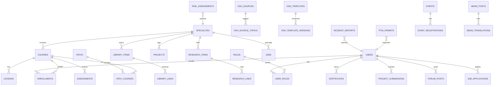

# Enterprise ERD — Wadnooh Software & Computer

Logical model for the **target** database (Phase 2–3). Phase 1 uses JSON catalogs + Identity/SQLite for travel/membership leftovers.

## Mermaid ER diagram

## Table dictionary (core)

| Table | Purpose | Key fields |
|-------|---------|------------|
| `users` | Accounts | id, email, password_hash, full_name, locale, created_at |
| `roles` / `user_roles` | RBAC | role_code: SystemAdmin, Supervisor, Author, Teacher, TA, Student, Guest, Employer |
| `specialties` | Engineering + OSH departments | slug, icon, name_ar/en, desc_ar/en, aliases |
| `courses` | Academy catalog | specialty_id, level, hours, media flags, certificate_flag |
| `lessons` | Course content units | course_id, sort, title_*, body_* |
| `paths` / `path_courses` | Competency paths | ordered course list |
| `enrollments` | Progress | user_id, course_id, completed_lesson_ids, percent |
| `library_items` | Metadata + official URLs | type, org, year, topics[], url, note_* |
| `projects` | Innovation hub | specialty_id, bom JSON, steps_*, skills[] |
| `assessments` / `qbank_items` | Exams Phase 2 | course_id, type, payload |
| `certificates` | Issuance | user_id, course_id, code, verified_at (null in P1) |
| `osh_sources` | Legal aggregator | org, region, url, summary_*, last_refreshed |
| `osh_templates` | Incident/PTW/etc. | code, title_*, format, storage_uri (Phase 2 files) |
| `risk_assessments` | OSH entities | matrix JSON, register status |
| `ptw_permits` | Permit to work | type, status, controls JSON |
| `incident_reports` | Incidents / near miss | severity, rca_json, corrective_actions |
| `research_items` | Research center | abstract_*, doi_url (link only) |
| `jobs` / `job_applications` | Careers Phase 3 | employer_id, specialty_id |
| `forum_threads` / `forum_posts` | Discussion Phase 2 | specialty_id |
| `events` / `news_posts` | Portal newsroom | dates, status |
| `ai_sessions` | Copilot audit (optional) | user_id, intent, topic |

## Phase-1 mapping

| Enterprise concept | Phase-1 artifact |
|--------------------|------------------|
| specialties | `wwwroot/data/departments.json` |
| courses/lessons/paths | `courses.json` |
| library | `library.json` |
| projects | `projects.json` |
| osh_sources/templates | `osh-sources.json` |
| events/qbank teasers | `events.json` |
| articles/news | `articles.json` |
| faq | `faq.json` |
| users/membership | ASP.NET Identity + existing controllers |
